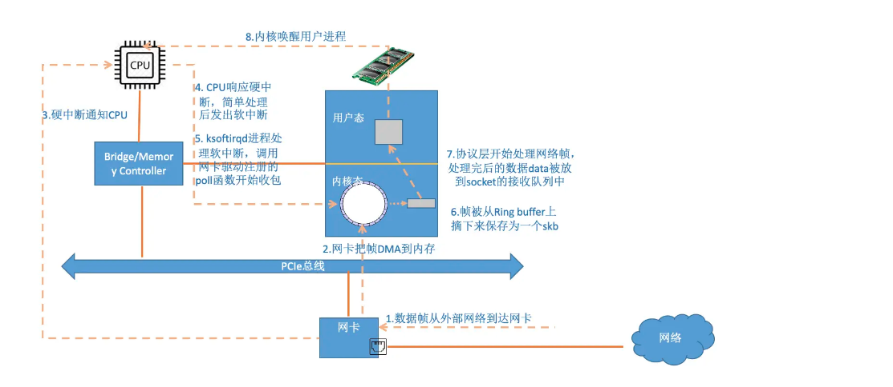
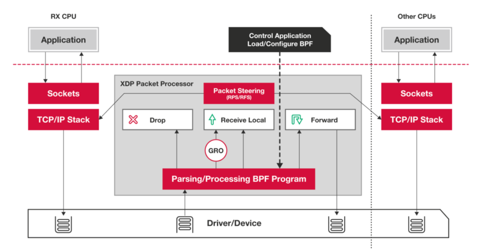
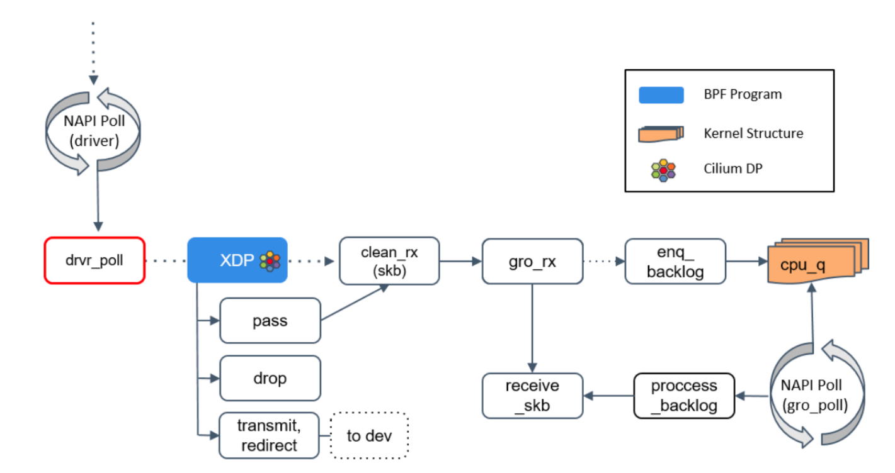
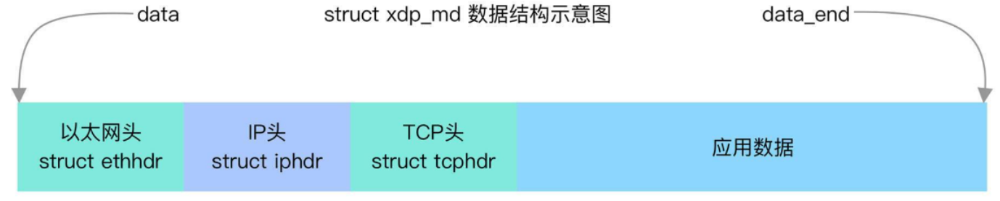
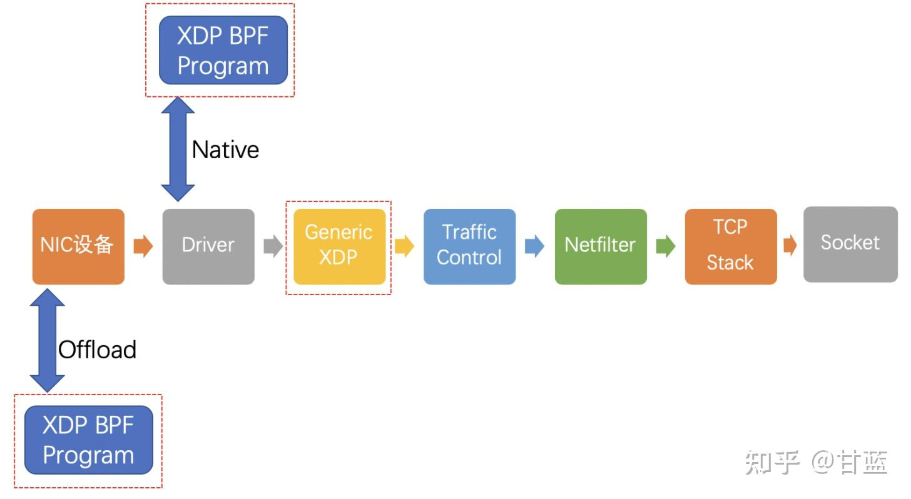
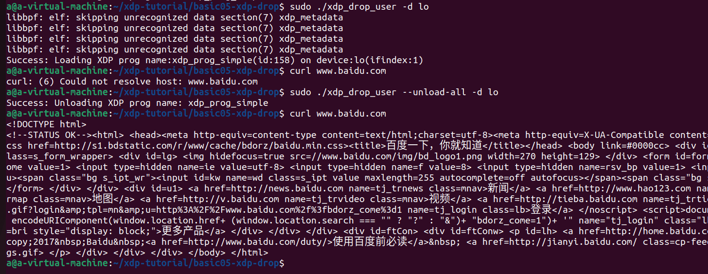

# XDP

## 1.XDP是什么？

XDP或Express Data Path的兴起是因为Linux内核需要一个高性能的包处理能力。XDP 高速处理路径的关键点在于这些编程字节码被加载到网络协议栈最早期的可能处理点上，就在网络包接受队列（RX）之后。



在网卡把数据包拷贝到接受队列之后就触发了 XDP 的钩子函数，在这一点上我们可以高效地阻止申请各种各样的元数据结构，包括 sk_buffer。

XDP直接操作一个从 DMA（直接存储器存取）后端环形缓冲区中拿的原始的以太帧包，所以丢弃逻辑可以很早地执行，这样就节省了内核时间，避免了会导致协议栈执行导致的延时。





XDP能够在最早的位置（网卡驱动执行poll函数时）对包进行处理并做出决策（丢弃、转发、继续传递给上层协议栈处理）。

## 2.XDP如何对包进行处理，并做出决策？

XDP暴露的钩子具有特定的输入上下文，它是单一输入参数。它的类型为 **struct xdp_md**，在内核头文件[bpf.h](https://cloud.tencent.com/developer/tools/blog-entry?target=https%3A%2F%2Felixir.bootlin.com%2Flinux%2Flatest%2Fsource%2Finclude%2Fuapi%2Flinux%2Fbpf.h%23L3309) 中定义，具体字段如下所示：

```
// kernel v6.4
struct xdp_md {
	__u32 data;
	__u32 data_end;
	__u32 data_meta;
	/* Below access go through struct xdp_rxq_info */
	__u32 ingress_ifindex; /* rxq->dev->ifindex */
	__u32 rx_queue_index;  /* rxq->queue_index  */

	__u32 egress_ifindex;  /* txq->dev->ifindex */
};
```

程序执行时，**data**和**data_end**字段分别是数据包开始和结束的指针，它们是用来获取和解析传来的数据，第三个值是**data_meta**指针，初始阶段它是一个空闲的内存地址，供XDP程序与其他层交换数据包元数据时使用。最后两个字段分别是接收数据包的接口和对应的RX队列的索引。当访问这两个值时，BPF代码会在内核内部重写，以访问实际持有这些值的内核结构**struct xdp_rxq_info**。



在处理完一个数据包后，XDP程序会返回一个动作（Action）作为输出，它代表了程序退出后对数据包应该做什么样的最终裁决，也是在内核头文件[bpf.h](https://cloud.tencent.com/developer/tools/blog-entry?target=https%3A%2F%2Felixir.bootlin.com%2Flinux%2Flatest%2Fsource%2Finclude%2Fuapi%2Flinux%2Fbpf.h%23L3298) 定义了以下5种动作类型：

```
// kernel v6.4
/* User return codes for XDP prog type.
 * A valid XDP program must return one of these defined values. All other
 * return codes are reserved for future use. Unknown return codes will
 * result in packet drops and a warning via bpf_warn_invalid_xdp_action().
 */
enum xdp_action {
	XDP_ABORTED = 0, //处理过程中产生异常
	XDP_DROP, //丢包
	XDP_PASS, //传递给协议栈继续处理
	XDP_TX, //使用收包网卡再继续发送出去
	XDP_REDIRECT, //1.重定向到其他网卡发送出去 2.重定向到其他CPU 3.重定向到AF_XDP socket
};
```

• XDP_ABORTED意味着程序错误，会将数据包丢掉，与XDP_DROP不同之处在于XDP_ABORTED会用trace_xdp_exception记录错误行为。

• XDP_DROP会在网卡驱动层直接将该数据包丢掉，无需再进一步处理，也就是无需再耗费任何额外的资源。在收到DDoS攻击时，这种特性可以瓦解DDoS的根本目标——占满被攻击主机的CPU资源使得其他正常流量无法被处理，因为XDP丢包不会再动用额外的CPU资源。

• XDP_PASS会将该数据包继续送往内核的网络协议栈，和传统的处理方式一致。这也使得XDP可以在有需要的时候方便地使用传统的内核协议栈进行处理。

• XDP_TX会将该数据包从同一块网卡返回。

• XDP_REDIRECT则是将数据包重定向到其他的网卡或CPU，结合AF_XDP可以将数据包直接送往用户空间。

## 3.XDP为何能带来性能提升？



**XDP工作模式**

- `xdpdrv`

  `xdpdrv` 表示 **native XDP**（原生 XDP）, 意味着 BPF 程序**直接在驱动的接收路径上运行**，理论上这是软件层最早可以处理包的位置。这是**常规/传统的 XDP 模式，需要驱动实现对 XDP 的支持**，目前 Linux 内核中主流的 10G/40G 网卡都已经支持。

- `xdpoffload`

  一些智能网卡（例如支持 Netronome’s nfp 驱动的网卡）实现了 `xdpoffload` 模式 ，允许将整个 BPF/XDP 程序 offload 到硬件，因此程序在网卡收到包时就直接在网卡进行 处理。这提供了比 native XDP 更高的性能，虽然在这种模式中某些 BPF map 类型 和 BPF 辅助函数是不能用的。BPF 校验器检测到这种情况时会直接报错，告诉用户哪些东西是不支持的。除了这些不支持的 BPF 特性之外，其他方面与 native XDP 都是一样的。

- `xdpgeneric`

  `xdpgeneric` 表示 **generic XDP**（通用 XDP），用于给那些还没有原生支持 XDP 的驱动进行试验性测试。generic XDP hook 位于内核协议栈的主接收路径上，接受的是 `skb` 格式的包，但由于 **这些 hook 位于 ingress 路径的很后面**，因此与 native XDP 相比性能有明显下降。因此，`xdpgeneric` 大部分情况下只能用于试验目的，很少用于生产环境。

## 4.eBPF/XDP程序如何解析packet？

eBPF/XDP程序是如何一步步解析packet的：

```
int xdp_demo(struct xdp_md *ctx) {
	//从xdp程序的上下文参数获取数据包的起始地址和终止地址
	void *data = (void *)(long)ctx->data;
	void *data_end = (void *)(long)ctx->data_end;
	int offset = 0;
	
	//以太网头部
	struct ethhdr *eth = (struct ethhdr *)data;
	//以太网头部偏移量
	offset = sizeof(struct ethhdr);
	//异常数据包，丢弃
	if(data + offset > data_end)
		return XDP_DROP;
    h_proto = eth->h_proto;
	if (h_proto != htons(ETH_P_IP))
		return XDP_DROP; //为了简化程序，暂且只处理ipv4
    //ip头部
	struct iphdr *iph;
	iph = data + offset;
	offset += sizeof(struct iphdr);
	//异常数据包，丢弃
	if(data + offset > data_end)
		return XDP_DROP;
	//从ip头部获取信息
	u8 ipproto = iph->protocol;
	u32 saddr = iph->saddr;
	u32 daddr = iph->daddr;
	if(ipproto == IPPROTO_TCP){
	   struct tcphdr *tcph = data + offset;
	   offset += sizeof(struct tcphdr);
	   if(data + offset > data_end)
	      return XDP_DROP;
	   //从tcp头部获取信息
	   u16 sport = tcph->source;
	   u16 dport = tcph->dest;
	}
	else if(ipproto == IPPROTO_UDP){
	   struct udphdr *udph = data + offset;
	   offset += sizeof(struct udphdr);
	   if(data + offset > data_end)
	      return XDP_DROP;
	   //从udp头部获取信息
	   u16 sport = udph->source;
	   u16 dport = udph->dest;
	}
	return XDP_PASS;
}
```

然后利用提取出来的saddr、daddr、sport、dport这些数据，返回相应的决策。

## XDP程序示例：

示例1：

```
#include <linux/bpf.h>
#define SEC(NAME) __attribute__((section(NAME), used))
SEC("prog")
int xdp_drop(struct xdp_md *ctx) {
   return XDP_DROP;
}
char __license[] SEC("license") = "GPL";
```

1. 第一部分是第一行的头文件`linux/bpf.h`，它包含了BPF程序使用到的所有结构和常量的定义（除了一些特定的子系统，如**TC**，它需要额外的头文件)。理论上来说，所有的eBPF程序第一行都是这个头文件。
2. 第二部分是第二行的宏定义，它的作用是赋予了`SEC(NAME)`这一串字符具有意义，即可以被编译通过。我截取了Linux内核代码里的注释，可以看出这段宏定义是为了ELF格式添加**Section**信息的。ELF全称是**Executable and Linkable Format**，就是可执行文件的一种主流格式，广泛用于Linux系统，我们的BPF程序一旦通过编译后，也会是这种格式。下面代码中的`SEC("xdp")`和`SEC("license")`都是基于这个宏定义。
3. 第三部分，也就是我们的代码主体，它是一个命名为`xdp_drop`函数，，返回值为int类型，接受一个参数，类型为**xdp_md**结构，上文已经介绍过，这个例子没有使用到这个参数。函数内的就是一行返回语句，使用**XDP_DROP**，也就是1，意思就是丢弃所有收到的数据包。
4. 第四部分是最后一行的许可证声明。这行其实是给程序加载到内核时BPF验证器看的，因为有些eBPF函数只能被具有**GPL**兼容许可证的程序调用。因此，验证器会检查程序所使用的函数的许可证和程序的许可证是否兼容，如果不兼容，则拒绝该程序。
5. 还有一点，整个程序是没有**main**入口的，事实上，程序的执行入口可以由前面提到的ELF格式的对象文件中的**Section**来指定。入口也有默认值，它是ELF格式文件中**.text**这个标识的内容，程序编译时会将能看到的函数放到**.text**里面。



示例2：

```
#include <linux/bpf.h>
#include <bpf/bpf_helpers.h>

SEC("xdp")
int  xdp_prog_simple(struct xdp_md *ctx)
{
	return XDP_PASS;
}

char _license[] SEC("license") = "GPL";

```

这个程序使用的是 XDP_PASS 传递给协议栈继续处理。也就是什么也不做。

