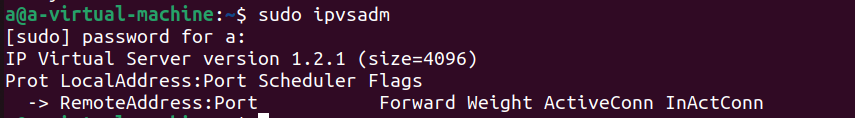
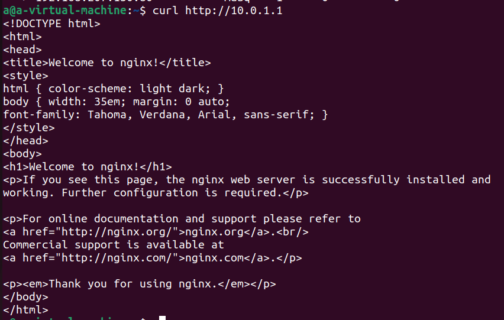
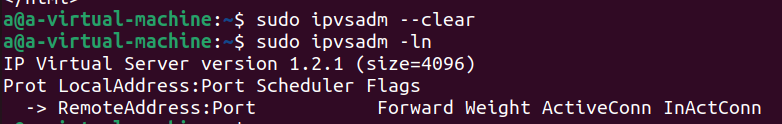
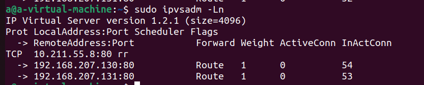

# 搭建LVS负载均衡环境实验

负载均衡调度机制提供内核补丁的集合 ， 称为虚拟服务器或 的 模块 。 这些模块在传输层交换信息 ， 使得 多 个服务器在外界看来公用 一个单一 的地址 。IPVS 通过在内核中建立 IPVS 表来有效地跟踪和路由数据包到真实服务器，LVS路出器查询该表获得一个虚拟服务器地址，并从真实服务器池返回的请求数据。根据成员的可用性IPVS 表被 ipvsadm 不断更新、添加和删除。

| 主机名      | 配置        | IP地址                 |
| ----------- | ----------- | ---------------------- |
| loadbalance | ubuntu22.04 | 192.168.207.129        |
|             |             | 虚拟服务器IP：10.0.1.1 |
| realserver  | ubuntu20.04 | 192.168.207.130        |
| realserver  | ubuntu20.04 | 192.168.207.131        |

安装ipvsadm成功：



```text
执行ipvsadm有两种基本格式：
1.  ipvsadm COMMAND [protocol] service-address 
                      [scheduling-method] [persistence options]
2.  ipvsadm command [protocol] service-address
            server-address [packet-forwarding-method] [weight options]
第一种格式用来管理一个虚拟服务对象（virtual service），这个格式的命令可以用来给这个虚拟服务指定后端服务器的均衡算法（algorithm），同时，你也可以通过这种格式的命令为这个虚拟服务配置长链接等参数。总之，这种格式是用来管理虚拟服务对象的。
第二种格式用来在一个已存在的虚拟服务对象（virtual service）里管理其后端真实服务器（real server）。你可以通过这种格式来指定某个后端服务器的转发规则（packet-forwarding method）以及其权重（weight）。如果你不指定的话，就会用默认值。
```

查看ipvsadm规则：


首先需要启动 2 台 Linux 虚机，使用 ubuntu 作为操作系统，第二个节点上安装 Docker 并以 host 网络模式运行 nginx 容器：

```
docker run --name nginx --network host --restart always -d nginx:latest
```

需要关闭 firewalld `systemctl stop firewalld && systemctl disable firewalld`，否则会导致无法通过主机 IP 访问 nginx 服务。

```
需要关闭 firewalld `systemctl stop firewalld && systemctl disable firewalld`，否则会导致无法通过主机 IP 访问 nginx 服务。
```

### NAT/Masquerade 模式

NAT 是负载均衡最经典的办法：负载均衡会改变每个来包的目的 IP 地址。

**必须先开启 IP 转发**：

```
$ echo "net.ipv4.ip_forward = 1" >> /etc/sysctl.conf
$ sysctl -p
```

在作为负载均衡器的节点添加 IPVS 规则（VIP 为 10.0.1.1）：

```text
$ ipvsadm -A -t 10.0.1.1:80 -s rr
```

命令说明：

- -A：append：添加一个虚拟服务器；
- -t：tcp-service：对tcp协议作转发；
- 192.168.0.123:80：service-address：VIP地址以及端口号；
- -s：schduler：均衡算法；
- rr：round robin：将工作平均分配给可用的真实服务器的算法。

以 Masquerade 的方式（`-m` 选项）添加两个后端：

```text
$ ipvsadm -a -t 10.0.1.1:80 -r 10.211.55.69:80 -m
$ ipvsadm -a -t 10.0.1.1:80 -r 10.211.55.70:80 -m
$ ipvsadm -Ln
IP Virtual Server version 1.2.1 (size=4096)
Prot LocalAddress:Port Scheduler Flags
  -> RemoteAddress:Port           Forward Weight ActiveConn InActConn
TCP  10.0.1.1:80 rr
  -> 10.211.55.69:80              Masq    1      0          0
  -> 10.211.55.70:80              Masq    1      0          0
```

命令说明：

- -a：append：添加一个后端真实服务器
- -t：tcp-service：转发tcp协议
- 192.168.0.123:80：service-address：刚才新增的虚拟服务器地址
- -r：real-server：后端真实服务器地址
- -g：Direct Routing转发模式
- -w：weight：权重

在负载均衡节点上通过 VIP 来访问：

```
$ curl http://10.0.1.1
```



通过两个后端节点的 nginx 容器日志就能够看出请求被转发至哪个后端节点。

但是，NAT 在性能方面有明显的短板，但对于小型系统来说问题不大。还要注意，后端看不到原来的目标 IP 因为被负载均衡器改掉了，**但仍能拿到源 IP 和端口**，这对许多应用程序来说至关重要。

### Direct Routing 模式

删除原本创建的负载均衡器：



首先还是搭建负载均衡器（注意要使用 `-g` 选项）：

```
$ ipvsadm -A -t 10.211.55.8:80 -s rr
$ ipvsadm -a -t 10.211.55.8:80 -r 10.211.55.69:80 -g
$ ipvsadm -a -t 10.211.55.8:80 -r 10.211.55.70:80 -g
$ ipvsadm -Ln
IP Virtual Server version 1.2.1 (size=4096)
Prot LocalAddress:Port Scheduler Flags
  -> RemoteAddress:Port           Forward Weight ActiveConn InActConn
TCP  10.211.55.8:80 rr
  -> 10.211.55.69:80              Route   1      0          0
  -> 10.211.55.70:80              Route   1      0          0
```

**现在后端节点也同样需要 VIP**，将 VIP 10.211.55.8 添加至回环设备：

```
$ ip addr add 10.211.55.8/32 dev lo
$ ip addr show lo
1: lo: <LOOPBACK,UP,LOWER_UP> mtu 65536 qdisc noqueue state UNKNOWN group default qlen 1000
    link/loopback 00:00:00:00:00:00 brd 00:00:00:00:00:00
    inet 127.0.0.1/8 scope host lo
       valid_lft forever preferred_lft forever
    inet 10.211.55.8/32 scope global lo
       valid_lft forever preferred_lft forever
    inet6 ::1/128 scope host
       valid_lft forever preferred_lft forever
```

我们还要将 VIP 10.211.55.8 分配给负载均衡节点的默认网卡（eth0）：

```
$ ip addr add 10.211.55.8/32 dev ens33
```

在测试节点（可能需要于同一网络另起一台虚机）上通过 VIP 来访问：

```
$ curl http://10.211.55.8:80
```

多尝试几次我们会发现所有的应答都来自后端节点 1，后端节点 2 却从未应答，

这就是麻烦的地方了，后端节点 1 的网络设备（lo）上也分配了 VIP，当测试节点询问与 VIP 绑定的 MAC 时，后端节点 1 与 2 也会应答，取决于查询先到达哪个节点，网关会将应答缓存在它的 ARP 表中。所以我们要采取措施来避免这种情况，VIP 被添加在后端节点的回环设备上。**我们要让这两个节点不要公布自己的 VIP**：

```
$ cat <<EOF > /etc/sysctl.d/ipvs.conf
net.ipv4.conf.eth0.arp_ignore=1
net.ipv4.conf.eth0.arp_announce=2
EOF
$ sysctl -p /etc/sysctl.d/ipvs.conf
```

然后在测试节点上清除 ARP 缓存：

```
$ ip -s -s neigh flush all
10.211.55.2 dev eth0 lladdr a6:83:e7:ba:3d:64 ref 1 used 0/0/0 probes 4 DELAY
10.211.55.8 dev eth0 lladdr 00:1c:42:69:93:e6 used 75/70/52 probes 4 STALE

*** Round 1, deleting 2 entries ***
*** Flush is complete after 1 round ***
```

再次 curl 轮询就生效了。



### IP Tunneling模式

IPIP 模式和 Direct Routing 模式有点像因为原 IP 包没变，而是被封装进了另一个 IP 包发送到目标服务器。

第一步还是搭建负载均衡器（注意要使用 `-i` 选项）：

```
$ ipvsadm -A -t 10.211.55.8:80 -s rr
$ ipvsadm -a -t 10.211.55.8:80 -r 10.211.55.69:80 -i
$ ipvsadm -a -t 10.211.55.8:80 -r 10.211.55.70:80 -i
$ ipvsadm -Ln
IP Virtual Server version 1.2.1 (size=4096)
Prot LocalAddress:Port Scheduler Flags
  -> RemoteAddress:Port           Forward Weight ActiveConn InActConn
TCP  10.211.55.8:80 rr
  -> 10.211.55.69:80              Tunnel  1      0          0
  -> 10.211.55.79:80              Tunnel  1      0          0
```

第二步在后端节点上启用 IPIP 隧道：

```
# Load the IPIP module
$ modprobe ipip
$ ip link set tunl0 up
```

接着将 VIP 10.211.55.8 分配给 TUN 设备：

```
$ ip addr add 10.211.55.8/32 dev tunl0
$ ip addr show tunl0
4: tunl0@NONE: <NOARP,UP,LOWER_UP> mtu 1480 qdisc noqueue state UNKNOWN group default qlen 1000
    link/ipip 0.0.0.0 brd 0.0.0.0
    inet 10.211.55.8/32 scope global tunl0
       valid_lft forever preferred_lft forever
```

将 VIP 10.211.55.8 分配给负载均衡节点的默认网卡（eth0）：

```
$ ip addr add 10.211.55.8/32 dev eth0
```

这里同样要像 Direct Routing 模式那样在后端节点上调整 ARP 设置：

```
$ cat <<EOF > /etc/sysctl.d/ipvs.conf
net.ipv4.conf.eth0.arp_ignore=1
net.ipv4.conf.eth0.arp_announce=2
EOF
$ sysctl -p /etc/sysctl.d/ipvs.conf
```

如果现在就 curl，啥都没有，因为过来的数据包被 Linux 反向路径过滤了，这个过滤器会检查数据包是否来自出包的方向，在这个案例中不是的。所以要关掉 tunl0 网卡的 rp_filter：

```
$ sysctl net.ipv4.conf.all.rp_filter=0
$ sysctl net.ipv4.conf.tunl0.rp_filter=0
```


